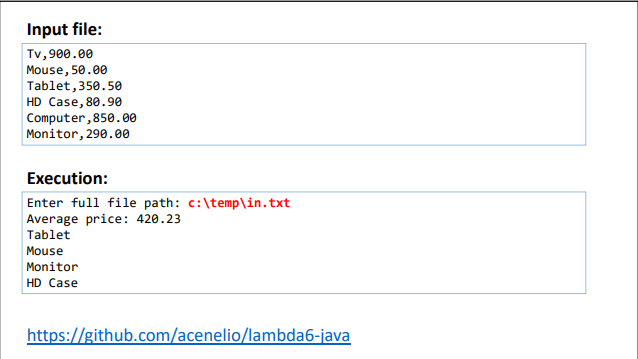
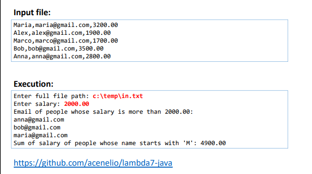

EXERCÍCIO 1

Fazer um programa para ler um conjunto de produtos a partir de um
arquivo em formato .csv (suponha que exista pelo menos um produto).
Em seguida mostrar o preço médio dos produtos. Depois, mostrar os
nomes, em ordem decrescente, dos produtos que possuem preço
inferior ao preço médio.
Veja exemplo na próxima página

EXERCÍCIO DE FIXAÇÃO:

Fazer um programa para ler os dados (nome, email e salário)
de funcionários a partir de um arquivo em formato .csv.

Em seguida mostrar, em ordem alfabética, o email dos
funcionários cujo salário seja superior a um dado valor
fornecido pelo usuário.

Mostrar também a soma dos salários dos funcionários cujo
nome começa com a letra 'M'.
Veja exemplo na próxima página.

