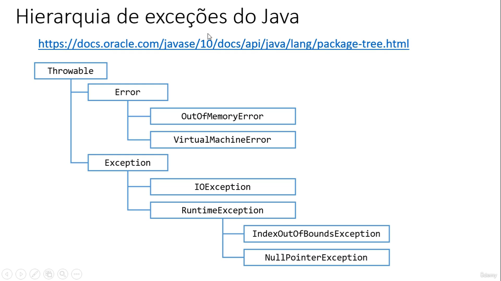
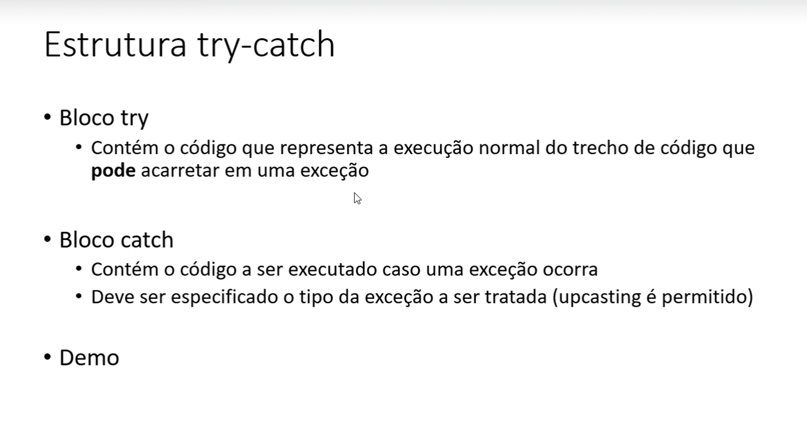

<h1>Exceções:</h1>

  - Uma excessão é qualquer condição de erro ou comportamento inesperado encontrado por um pro grama EM EXECUÇÃO.

- Em java, uma exceção é um objeto herdado da classe:
    - java.lang.Exception - o compilador obriga a tratar ou propagar.
    - java.lang.RuntimeException - o compilador não obriga a tratar ou propagar.

- Quando lançada, uma exceção é propagada na pilha de chamadas de métodos em execução, até que seja capturada (tratada) ou o programa seja encerrado.

https://docs.oracle.com/javase/10/docs/api/java/lang/package-tree.html

<h2>Por que exceções?</h2>

  - o modelo de tratamento de exceções permite que erros sejam tratados de forma consistente e flexível, usando boas práticas.
  - 
- vantagens: 
  - Delega a lógica do erro para a classe responsável por conhecer as regras que podem ocasionar o erro.
  - Trata de forma organizada (inclusive hierárquica) exceções de tipos diferentes.
  - A exceção pode carregar dados quaisquer.

<h1>Extrutura try-catch</h1>

- sintaxe:
  - 
  